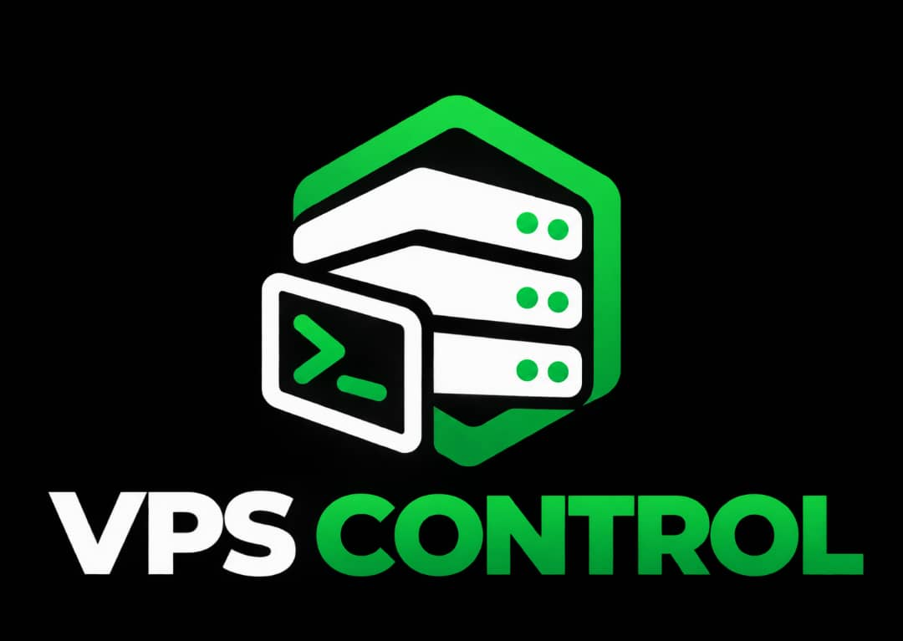

<p align="center"></p>

# VPS Control — marketing site

The marketing site and documentation for [VPS Control](https://github.com/Wazestudio/vps-control),
an open-source VPS admin panel. This repo is deliberately separate from the
panel's own repo: it's a 100% static site (vanilla HTML/CSS/JS, no build
step), it has no business sitting inside a Go project.

Built by [Waze Studio](https://github.com/Wazestudio).

## Contents

- `index.html`, `docs.html`, `style.css`, `app.js`, `assets/` — the site, to be hosted on `vpscontrol.wazestudio.com`
- `installer/get.sh` — the script to host as plain text on `install.vpscontrol.wazestudio.com`, so `curl -fsSL https://install.vpscontrol.wazestudio.com | sudo bash` works

See [`HOSTING.md`](HOSTING.md) for the full Nginx setup for both subdomains.

## Local development

No tooling required, it's static HTML/CSS/JS:

```bash
python3 -m http.server 8000
# then open http://localhost:8000
```

## License

MIT, same as the panel.
