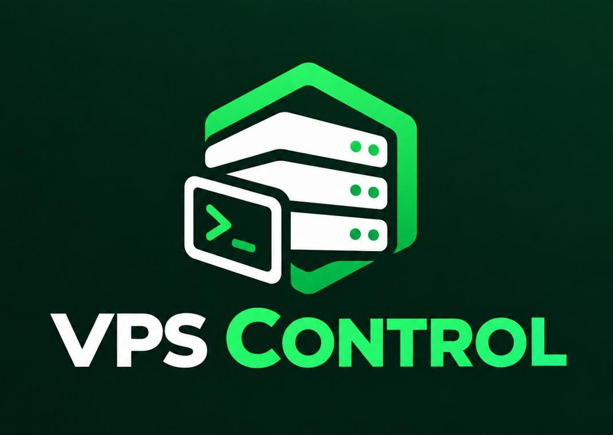

<p align="center"></p>

# VPS Control — site vitrine

Le site vitrine et la documentation de [VPS Control](https://github.com/VPSControl/vps-control),
un panel d'administration de VPS open source. Ce dépôt est volontairement
séparé de celui du panel : c'est un site 100 % statique (HTML/CSS/JS
vanilla, aucun build step), il n'a pas sa place dans le même dépôt qu'un
projet Go.

## Contenu

- `index.html`, `docs.html`, `style.css`, `app.js`, `assets/` — le site, à héberger sur `vpscontrol.wazestudio.com`
- `installer/get.sh` — le script à héberger en texte brut sur `install.vpscontrol.wazestudio.com`, pour permettre `curl -fsSL https://install.vpscontrol.wazestudio.com | sudo bash`

Voir [`HOSTING.md`](HOSTING.md) pour la configuration Nginx complète des
deux sous-domaines.

## Développement local

Aucun outil requis, c'est du HTML/CSS/JS statique :

```bash
python3 -m http.server 8000
# puis ouvrez http://localhost:8000
```

## Licence

MIT, comme le panel lui-même.
